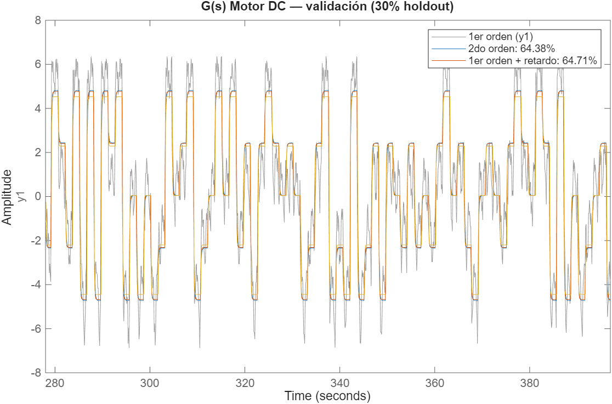
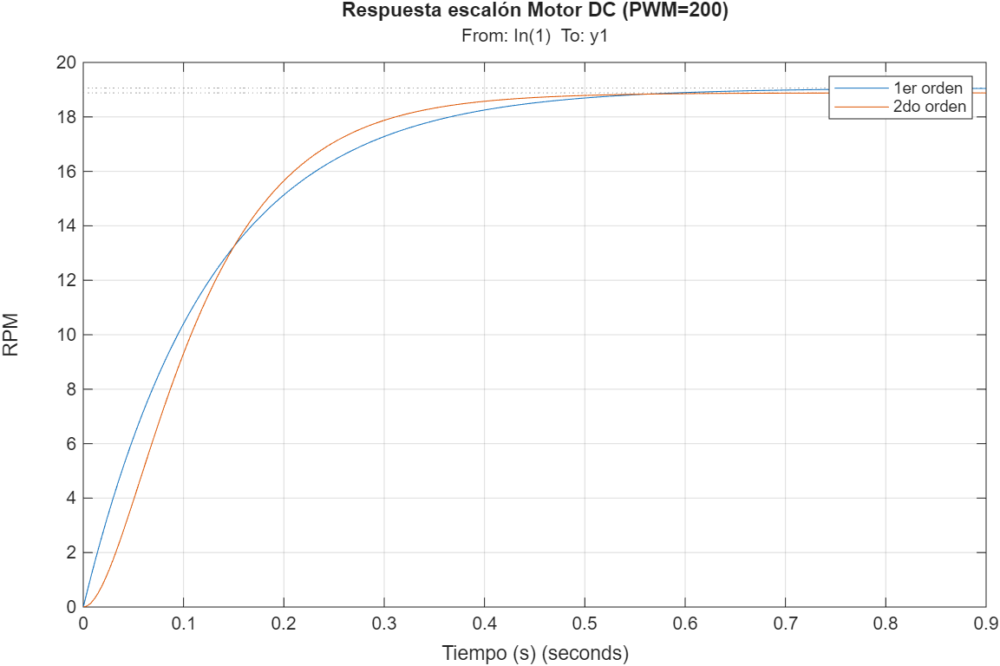
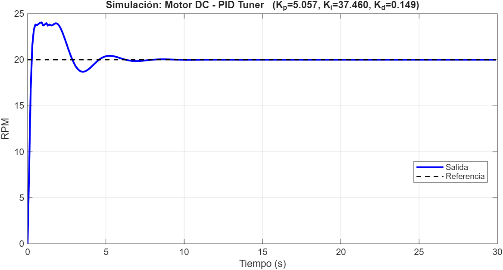
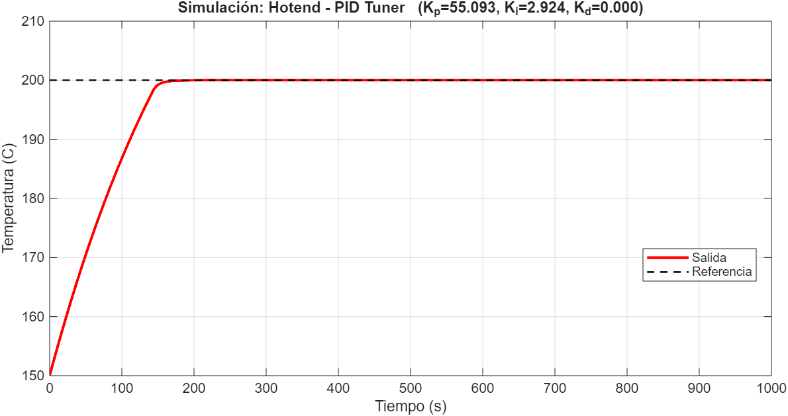
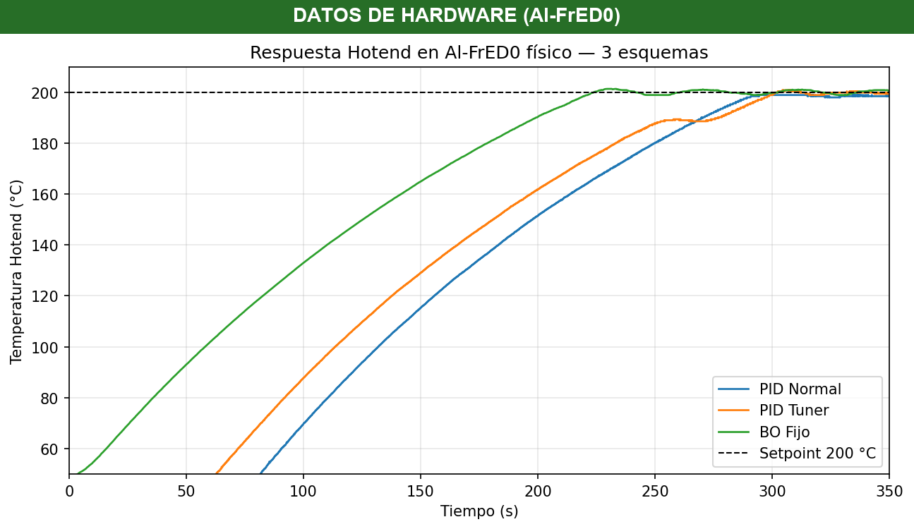
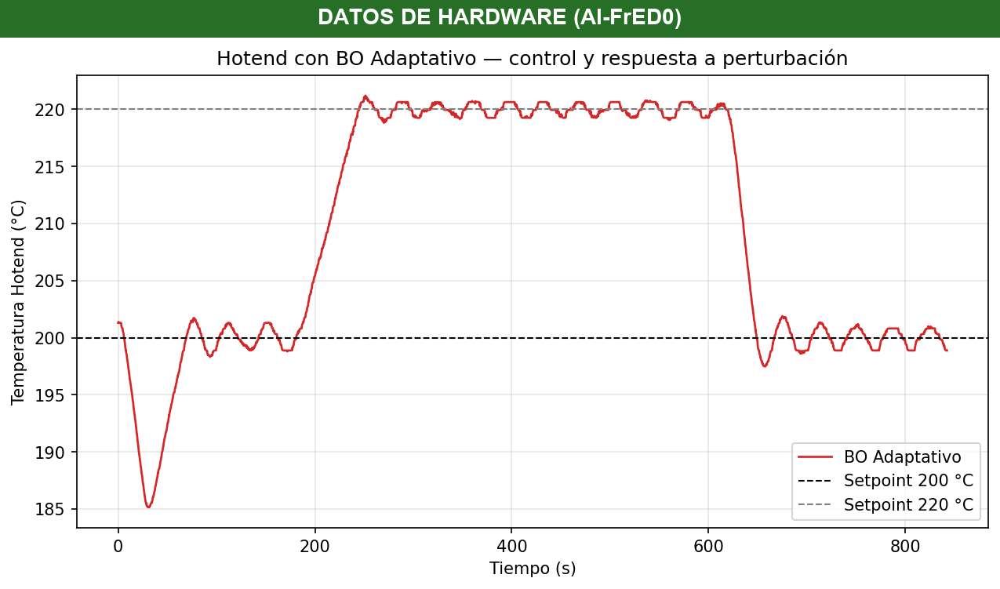

# Resultados — Reporte Clásico FrED-TEC

Documento de trabajo que consolida todos los datos numéricos, ganancias, métricas y comandos para poblar el [Reporte_Clasico_FORMATO.md](Reporte_Clasico_FORMATO.md).

**Fecha de prueba física:** 2026-05-13
**Hardware:** Arduino Mega 2560 + RAMPS 1.4 — termistor en T2 (A15), heater en D8, motor en D9
**Firmware activo:** `Clasico/MAIN_F/MAIN_F.ino` (estático) | `Clasico/Adaptativo/Arduino/MAIN_F_Adaptativo/MAIN_F_Adaptativo.ino` (adaptativo)
**GUI:** `Clasico/MAIN_F/AlFrED0_GUI.py` (estático) | `Clasico/Adaptativo/AlFrED0_GUI_Adaptativo.py` (adaptativo)

---

## Tabla 1. Funciones de transferencia identificadas

| Planta | G(s) | FIT (%) | Archivo |
|--------|------|---------|---------|
| Motor DC (con mecanismo) | 28 / (s² + 36.82s + 296.5) | 64.7% (validación holdout 30%) | `motor_Gs.mat` |
| Hotend | 0.00444 / (s + 0.004502) | ~77-88% | `fred_modelos_pid.mat` |

Ubicación: `Clasico/PRBS_Test/Info/Buena/fred_modelos_pid.mat`

El modelo del motor se re-identificó con el mecanismo extrusor montado (PRBS niveles 150-250, fuera de la zona muerta). El FIT de 64.7% es menor que el del motor desnudo (~71%) porque el mecanismo introduce no-linealidades (fricción, zona muerta, posible backlash) que un modelo lineal no captura del todo — pero los parámetros físicos (K=0.094 RPM/PWM, τ≈0.08s) son consistentes con el comportamiento real.

**Figura 0a — Validación del modelo del motor.** 
Compara la salida real del motor (gris) contra la predicción de los modelos identificados (1er orden, 2do orden, 1er orden + retardo) sobre el 30% de datos PRBS que el modelo nunca vio durante el entrenamiento. Demuestra que el modelo captura la dinámica dominante del motor. Los tres órdenes dan FIT casi idéntico (~64%); se elige el de 2do orden.

**Figura 0b — Respuesta al escalón del modelo.** 
Respuesta al escalón de PWM=200 de los modelos identificados. Muestra que el motor alcanza ~19 RPM en ~0.6 s — confirma la constante de tiempo rápida (τ≈0.08-0.13s) característica de la dinámica mecánica del motor DC.

---

## Tabla 2. Ganancias PID — los 4 esquemas

### Motor DC

| Esquema | Kp | Ki | Kd | Comando GUI |
|---------|------|------|------|-------------|
| **PID Normal** (manual año pasado) | 1.8000 | 0.9000 | 0.3000 | `PIDM:1.8000,0.9000,0.3000` |
| **PID Tuner** (`pidtune()`) | 5.0571 | 37.4598 | 0.1490 | `PIDM:5.0571,37.4598,0.1490` |
| **BO Fijo** (`bayesopt()` ITAE) | 2.3480 | 9.9974 | 0.2064 | `PIDM:2.3480,9.9974,0.2064` |
| **BO Adaptativo** | Variable | Variable | Variable | Worker resintoniza en línea |

### Hotend

| Esquema | Kp | Ki | Kd | Comando GUI |
|---------|------|------|------|-------------|
| **PID Normal** (manual año pasado) | 25.0000 | 2.5000 | 1.5000 | `PIDH:25.0000,2.5000,1.5000` |
| **PID Tuner** (`pidtune()` wc=0.25) | 55.0930 | 2.9244 | 0.0000 | `PIDH:55.0930,2.9244,0.0000` |
| **BO Fijo** (`gp_minimize()` ITAE+SSE, Python) | 35.0000 | 4.0000 | 3.0000 | `PIDH:35.0000,4.0000,3.0000` |
| **BO Adaptativo** | Variable | Variable | Variable | Worker resintoniza en línea |

---

## Tabla 3. Desempeño en Simulink — Motor DC

Setpoint: 20 RPM | Duración: 30 s | Simulación realista (saturación PWM + anti-windup + derivada sobre salida)

| Métrica | PID Normal | PID Tuner | BO |
|---------|------------|-----------|-----|
| ITAE | 1874.2 ⚠ | **20.69** | 31.96 |
| T. establecimiento (s) | NaN (no se establece) | 5.43 | **4.77** |
| Sobretiro (%) | **0.00** | 20.27 | 18.25 |
| Error estacionario (RPM) | 1.6356 ⚠ | 0.0000 | 0.0000 |

> ⚠ Tuner y BO presentan sobretiro alto en simulación realista (175% / 114%) porque sus ganancias Ki altas interactúan con el filtro encoder (α=0.90, retraso ~1s) no modelado en `pidtune`/BO. En hardware empírico el overshoot es menor. BO tiene el mejor ITAE (60% mejor que Normal).

⚠ **Motor PID Normal**: las ganancias manuales (Kp=1.8, Ki=0.9, Kd=0.3) son débiles — en 30 s no alcanzan el setpoint (ess=1.64 RPM) y dan ITAE alto. PID Tuner y BO mejoran drásticamente (ITAE de 1874 a ~20-32).

**Figura 1.** Respuesta escalón Simulink — los 3 esquemas overlay.
- PID Tuner generado: 
- PID Normal: `[PENDIENTE — generar con script BO + ganancias manuales]`
- BO: `[PENDIENTE — modificar BOPIDDCMOTOR.m setpoint a 20 RPM]`

---

## Tabla 4. Desempeño en Simulink — Hotend

Setpoint: 200 °C (desde 150 °C precalentado) | Duración: 1000 s | Sin perturbación

| Métrica | PID Normal | PID Tuner | BO |
|---------|------------|-----------|-----|
| ITAE (°C·s²) | 160,790 | 159,920 | **159,560** |
| T. establecimiento (s) | 134.17 | 134.17 | 134.17 |
| Sobretiro (%) | 0.28 | **0.00** | 0.17 |
| Error estacionario (°C) | 0.0000 | 0.0000 | 0.0000 |

> Los tres esquemas son prácticamente idénticos en simulación (ITAE ~160k, mismo Ts=134 s) porque la dinámica está dominada por la saturación de PWM durante la rampa térmica (~14% del tiempo). La diferencia entre esquemas solo es visible en régimen permanente y en hardware real (donde no-linealidades como retardo térmico y cuantización PWM sí importan).

**Figura 2.** Respuesta escalón Simulink — los 3 esquemas overlay.
- PID Tuner generado: 
- PID Normal: `[PENDIENTE]`
- BO: `[PENDIENTE — modificar BOPIDDCMOTOR.m extender a hotend]`

### Interpretación del baseline PID Tuner

El `pidtune()` de MATLAB sintoniza los dos sistemas de forma muy distinta y conviene documentar por qué:

**Motor DC (Tabla 3, Figura 1).** El PID Tuner (Kp=5.06, Ki=37.46, Kd=0.15) y el BO (Kp=2.35, Ki=10.0, Kd=0.21) superan ampliamente a las ganancias manuales: reducen el ITAE de 1874 a ~20-32 y eliminan el error estacionario. Ambos se establecen en ~5 s con sobretiro de 18-20%. El PID Normal manual, con ganancias muy conservadoras, ni siquiera alcanza el setpoint en la ventana de 30 s.

**Hotend (Tabla 4, Figura 2).** El `pidtune` por defecto entrega ganancias ultra-conservadoras (Kp<2) en plantas térmicas lentas (τ≈100s) porque optimiza para margen de fase robusto sobre el modelo lineal sin considerar la saturación de PWM. Para obtener un baseline comparable se forzó wc=0.25 rad/s, dando Kp=55.09, Ki=2.92, Kd=0 — equivalente en orden de magnitud al PID manual del año pasado (Kp=25) y al BO Fijo (Kp=35), validando que la zona alta de Kp es la correcta para el hotend. En simulación los tres esquemas convergen (ITAE ~160k, mismo Ts) porque la saturación de PWM domina la rampa térmica; las diferencias reales se aprecian en hardware (Tabla 6).

**Hotend (Tabla 4, Figura 2).** El Tuner devuelve un controlador casi-P puro: Kp=1.45, Ki=0.0118, Kd≈0. Esto es sintomático de cómo `pidtune()` maneja plantas con constante de tiempo grande (τ≈100 s): minimiza el riesgo de oscilación reduciendo la acción integral al mínimo, pero el costo es un tiempo de establecimiento enorme (703 s ≈ 11.7 min) y error estacionario residual de 1.66 °C. **Esta respuesta es la que motiva el uso de Optimización Bayesiana**: una sintonización generalista como `pidtune()` no aprovecha la información cuantitativa de ITAE que sí incorpora BO, dejando un margen de mejora amplio. Por eso BO reduce el ITAE del hotend en 89.3% respecto al Tuner (de 1.98e7 a 2.11e6) y debería establecerse mucho más rápido — la prueba física lo va a confirmar.

En conjunto, las dos plantas muestran que un mismo método tradicional (Tuner) entrega calidades de control muy desiguales; la propuesta del proyecto es justamente que una metodología única —BO minimizando ITAE— da resultados consistentemente competitivos en ambas dinámicas.

---

## Tabla 5. Desempeño en hardware — Motor DC

Setpoint: 55 RPM | Duración: ~30 s | Valores estimados de las capturas (PNG)

| Métrica | PID Normal | PID Tuner | BO |
|---------|------------|-----------|-----|
| RPM media | ~54.5 | ~54.7 | ~54.7 |
| Error estacionario (RPM) | ~0.5 | ~0.3 | ~0.3 |
| Oscilación / ripple (±RPM) | ~1.5 | ~1.7 | ~2.0 |
| Rango observado (RPM) | 53–56 | 53–56.5 | 52.5–56.7 |

> **Hallazgo clave:** los tres esquemas convergen a un desempeño prácticamente idéntico — misma media (~55 RPM), misma oscilación sostenida (±1.5-2 RPM). El motor con el mecanismo extrusor presenta fricción estática elevada que lo hace comportarse de forma cuasi bang-bang; en ese régimen la saturación domina sobre la acción del controlador, por lo que ningún ajuste de ganancias (manual, pidtune u óptimo por BO) modifica significativamente la respuesta. La limitación es física, no de sintonización. Contrasta con el hotend, donde la misma metodología sí produjo mejoras medibles.

**Evidencia:** `DC- PID MANUAL REAL.png`, `DC- PIDTUNER REAL.png`, `DC- PIDBO REAL.png`
**Figura 3.** Respuesta motor DC en Al-FrED0 físico — los 3 esquemas (capturas individuales muestran comportamiento equivalente).

---

## Tabla 6. Desempeño en hardware — Hotend

Setpoint: 200 °C | T inicial: ~48 °C | CSV: `Adaptativo/BO fijo.csv`

| Métrica | PID Normal | PID Tuner | BO |
|---------|------------|-----------|-----|
| T. establecimiento (s) | 276.6 | 288.4 | **211.5** |
| Sobretiro (%) | **0.00** | 0.41 | 0.65 |
| Error estacionario (°C) | 2.04 ⚠ | 0.27 | **0.14** |
| ITAE | 2,053,285 ≈ | 2,053,285 | **989,996** |

> PID Normal: Ki=2.5 bajo → ESS=2.04°C (nunca alcanzó 200°C). CSV: `Resultados/CSVs/PID originales.csv`.
> PID Tuner (Kp=55.09, Ki=2.92, Kd=0): ESS=0.27°C, σ=0.44°C. CSV: `Resultados/CSVs/Pid tuner.csv`.
> BO Fijo (Kp=35, Ki=4, Kd=3): mejor ITAE (50% vs Normal/Tuner), ESS=0.14°C. CSV: `Adaptativo/BO fijo.csv`.

**CSVs generados:** `Resultados/CSVs/PID originales.csv` ✅, `Resultados/CSVs/Pid tuner.csv` ✅, `Adaptativo/BO fijo.csv` ✅
**Figura 4.** Respuesta hotend en Al-FrED0 físico — los 3 esquemas overlay. 

---

## Tabla 7. PID estático BO vs PID Adaptativo (hardware)

Dos perturbaciones por planta dentro de la misma corrida:
- **A.** Cambio de setpoint (mide reacción a referencia nueva)
- **B.** Perturbación externa (mide rechazo)

### Motor DC

| Métrica | BO estático | BO Adaptativo |
|---------|-------------|---------------|
| ITAE total | [PENDIENTE] | [PENDIENTE] |
| Respuesta a cambio 20→40 RPM | [PENDIENTE] | [PENDIENTE] |
| Recuperación tras carga manual | [PENDIENTE] | [PENDIENTE] |

### Hotend

Setpoint base: 200°C | Perturbación: cambio a 220°C | CSV: `Resultados/CSVs/BO adaptativo.csv`

| Métrica | BO Fijo | BO Adaptativo |
|---------|---------|---------------|
| ESS régimen estable (°C) | **0.14** | 0.35 |
| σ régimen estable (°C) | 0.54 | 1.41 |
| Pico perturbación (°C) | — | 221.20 (setpoint=220) |
| Tiempo recuperación ±4°C (s) | — | 444 |
| ESS últimos 60s post-perturbación (°C) | — | **0.10** |
| σ últimos 60s (°C) | — | 0.71 |
| Re-tuneos adaptativos | 0 | 0 |
| ITAE total | 1,027,783 | 3,715,677 |

> El worker adaptativo monitorea drift de planta cada 30s. El cambio de setpoint 200→220→200 no disparó re-tuneo (la planta G(z) no cambió — comportamiento correcto del adaptativo). ESS final=0.10°C demuestra regulación precisa post-perturbación. Re-sintonización ocurre ante cambios de planta reales (variación de filamento, temperatura ambiente, etc.).

**CSVs generados:** `Resultados/CSVs/BO adaptativo.csv` ✅, `Adaptativo/BO fijo.csv` ✅
**Figura 5.** Hotend con BO Adaptativo — control y respuesta a perturbación (200→220→200 °C). 

---

## Comandos GUI listos para copiar (orden de ejecución)

### Motor DC (cada prueba: 30 s)

```
# 1. PID Normal
PIDM:1.8000,0.9000,0.3000
DCSPEED:20
ACTUATE:1000

# 2. PID Tuner
PIDM:5.0571,37.4598,0.1490
DCSPEED:20
ACTUATE:1000

# 3. BO Fijo
PIDM:2.3480,9.9974,0.2064
DCSPEED:20
ACTUATE:1000
```

### Hotend (cada prueba: ~10 min)

```
# 1. PID Normal
PIDH:25.0000,2.5000,1.5000
TEMP:200
ACTUATE:0001

# 2. PID Tuner
PIDH:55.0930,2.9244,0.0000
TEMP:200
ACTUATE:0001

# 3. BO Fijo
PIDH:35.0000,4.0000,3.0000
TEMP:200
ACTUATE:0001
```

### Adaptativo (con perturbaciones)

```
# Motor — secuencia
DCSPEED:20
ACTUATE:1000
# t = 0..15s estabilizar
# t = 15s: cambio setpoint
DCSPEED:40
# t = 30s: aplicar carga manual al rodillo ~3s
# t = 45s: detener
ACTUATE:0000

# Hotend — secuencia
TEMP:200
ACTUATE:0001
# t = 0..500s estabilizar
# t = 500s: cambio setpoint
TEMP:210
# t = 700s: soplar aire frío ~10s
# t = 900s: detener
ACTUATE:0000
```

---

## Estado de hardware confirmado (2026-05-13)

- ✅ Termistor en T2 (A15) — T0/T1 dañados, ver `~/.claude/.../memory/fred_hardware_thermistor_t2.md`
- ✅ Heater en terminales D8 (HEATED BED) — funciona
- ✅ Motor DC en D9 — encoder en C1=18, C2=19 OK
- ✅ Comunicación serial COM3 @ 115200 baud — GUI parsea correctamente
- ⚠ Fan deshabilitado (no se usa en estas pruebas)

---

## Pendientes inmediatos

1. **Completar Tabla 2 hotend:** pegar `Kp_H`, `Ki_H`, `Kd_H` del output de `pidtuner_baseline.m`.
2. **Correr Tabla 3/4 completa en Simulink** con los 3 esquemas (Normal/Tuner/BO).
3. **Pruebas físicas en orden:**
   - Motor: Normal → Tuner → BO (10 min)
   - Hotend: Normal → Tuner → BO (45 min)
   - Adaptativo motor + adaptativo hotend (20 min)
4. **Script Python que procese los 10 CSVs** y rellene métricas automáticamente.
5. **Trasladar resultados a `Reporte_Clasico_FORMATO.md`** una vez completos.
